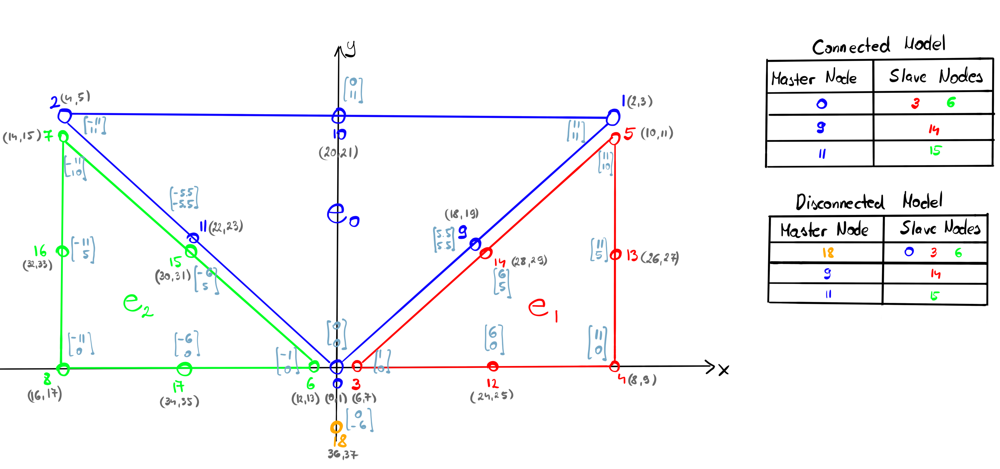

<p align="center">

</p>

This example consists of 3 disconnected triangles that are constrained by MPCs along their overlapping edges and nodes. All three triangles have overlapping nodes at the bottom center (origin), where constraining with an MPC becomes more interesting.

The following two constraint systems are tested:
- *connected case*: node ($0$) of the main triangle ($e_0$) is the master of the other two ($3$ and $6$) overlapping nodes.
- *disconnected case:* an external point ($18$), that is not part of any element, acts as the master of all 3 overlapping nodes ($0$, $3$, and $6$).

Each setup has a linear counterpart that consist only of linear triangles. In every case, all MPCs share a common coefficient, with no offsets:
```math
\mathbf{u}_S =
\begin{bmatrix}
    \ddots & & \\
    & c & \\
    & & \ddots
\end{bmatrix}
\mathbf{u}_M
```

Note that a coefficient $c=1$ means that overlapping nodes must have identical displacements, which makes the model identical to a mesh with 3 connected triangles. The hierarchical solver can solve this configuration well, however it runs into trouble when the coefficient $c \neq 1$.

# Connected Case

## $c = 1$

```bash
python MainKratos.py --mesh consistent_quadratic --mpc-coefficient 1
```

The hierarchical solver needs **11 iterations** (way more than expected `¯\_(ツ)_/¯`) to converge to a relative residual norm of $10^{-6}$ even though **the restricted system matrix is identical to that of the model's linear counterpart**.

|     |     |
|:---:|:---:|
|  |  |
| restriction operator | coarse system matrix |

## $c \neq 1$

```bash
python MainKratos.py --mesh consistent_quadratic --mpc-coefficient 1e-1
```

The hierarchical solver needs **15 iterations** (almost 50% more than the $c=1$ case) to converge to the same tolerance even though **the restricted system matrix is identical to that of the model's linear counterpart**.

|     |     |
|:---:|:---:|
|  |  |
| restriction operator | coarse system matrix |

# Disconnected Case


## $c=1$

```bash
python MainKratos.py --mesh quadratic --mpc-coefficient 1e0
```

The hierarchical solver needs **11 iterations** (identical to the connected $c=1$ case) to converge. **The restricted system matrix is identical to that of the model's linear counterpart**.

|     |     |
|:---:|:---:|
|  |  |
| restriction operator | coarse system matrix |

## $c \neq 1$

```bash
python MainKratos.py --mesh quadratic --mpc-coefficient 1e-1
```

This is a tricky one that exposes a flaw in the construction of the restriction operator, because **the coarse system matrix is no longer identical to its linear counterpart**. The difference of the two matrices ($K_{linear} - RK_{quadratic}R^T$) is shown below. Unsurprisingly, solving this system takes the longest with **21 iterations**.

|     |     |     |     |
|:---:|:---:|:---:|:---:|
| |  |  | |
| restriction operator | linear system matrix | coarse system matrix | coarse difference matrix |


# System Matrix Properties


It might be interesting to mention that the properties of the quadratic system matrix depend
greatly on the MPC coefficient. It might not have much to do with problems the hierarchical
solver runs into though. The figure below shows how some fine system matrix properties vary
as a function of $c$.

|     |     |
|:---:|:---:|
| |  |
| connected case | disconnected case |
